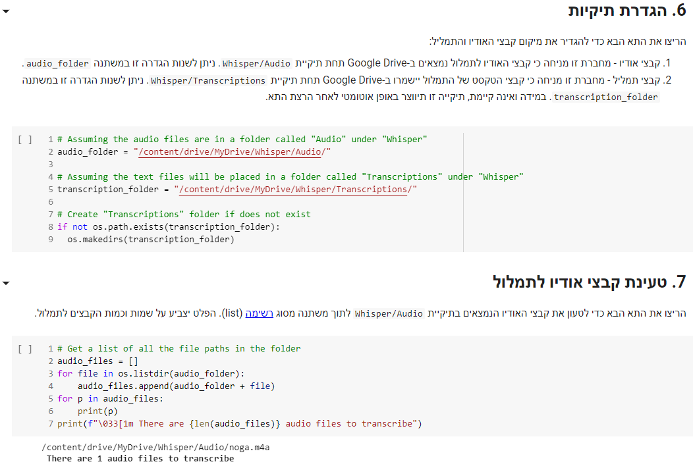

# תמלול אוטומטי של וידאו ואודיו באמצעות Whisper

[וויספר](https://openai.com/blog/whisper) (Whisper) היא מערכת לזיהוי דיבור (ASR: Automatic Speech Recognition) מבית [OpenAI](https://openai.com) הזמינה לציבור הרחב בקוד פתוח. מערכת זו אומנה על יותר מ-680 אלף שעות של אודיו באנגלית ובשפות רבות אחרות – בהן גם עברית וערבית. מטרת מחברות אלו היא להנגיש את יכולות התמלול של המערכת לציבור הרחב בצורה אינטואיטיבית ונוחה. 

## שימוש נכון במחברות

כדי להשתמש במחברות יש להיעזר ב־Google Colab – כלי שמאפשר לנו לצפות ולהריץ את המחברות שהכנו עבורכם מראש. 

מומלץ בחום להקדיש לכל מחברת בין יום לימודים אחד לשלושה ולפתור את כל התרגולים הנלווים. המחברות מחולקות באופן שמתאים ללימוד בקצב זה. לימוד מהיר מדי לא יאפשר לכם להטמיע את החומר, ובלימוד איטי מדי תתקשו לזכור חלק מהידע ועקב כך יקשה עליכם לחזור למסלול.

פתירת התרגילים היא חלק חשוב מאין כמוהו במסע שלכם – כפי שלא הייתם נותנים לחברכם לנהוג לאחר סיום קריאה של ספר התיאוריה, כך אתם עצמכם לא תדעו לתכנת עד שלא תפתרו את התרגילים. תרגול נכון יעזור לידע להיטמע ויאפשר לכם להבין את החומר לעומקו. אם יש לכם מכר שיודע פייתון היטב – תנו לו לבדוק את התרגילים שלכם. החניכים בקורסים שלי לאורך השנים העידו שמשוב מקצועי על התרגילים הוא אחד מכלי המפתח לשיפור עצום.

## דוגמה מתוך המחברות

## תודות

המחברות נכתבו על ידי [ים מסיקה](https://www.mesicka.com), בעזרתה הנדיבה של העורכת הלשונית [דפי בר אילן](https://www.dafibarilan.com/).
את מחברות הסיכום ברובן כתב איתמר רביב, ואת הלוגו עיצב [אליאל דן לוי](https://www.elielart.com/). למשתתפים נוספים ביצירת המחברות לחצו [פה](https://github.com/PythonFreeCourse/Notebooks/blob/master/AUTHORS.rst). 

